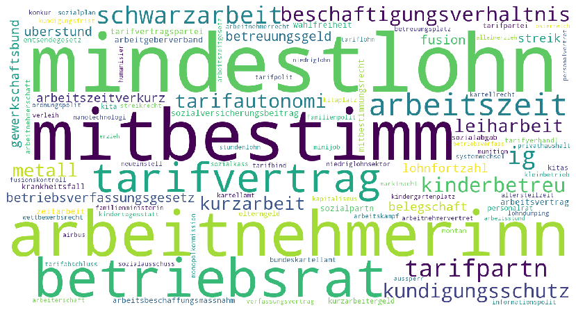
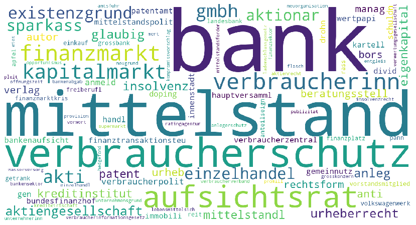

# LDA Topic Model 

This section provides additional information about the LDA topic model search tool on the [Open Discourse website](opendiscourse.de). 
Currently this section is only available in English. 

## Topics Documentation

Here you can find an overview about each of the 73 topics available in the Open Discourse frontend. For each topic you can find a word cloud visualizing the top 100 words as well as a list of the top 100 most relevant words that belong to the topic.


::::{.infobox .caution}

**Notice!**

> The word lists below are from the cleaned up corpus dictionary (stemmed, lemmatized). Therefor the words are in very basic short-forms so they can be applied to word inflections. 

::::

### Volkswirtschaft

**Word Cloud:**


**Word Table:**
```{r, echo=FALSE, message=FALSE, warning=FALSE, paged.print=FALSE}
first_topic <- read_csv("./data/topics/topic_0_Volkswirtschaft.csv")

first_topic %>%
  make_table(scrollable = TRUE)
```

### Bürger:innenrechte

**Word Cloud:**


**Word Table:**
```{r, echo=FALSE, message=FALSE, warning=FALSE, paged.print=FALSE}
first_topic <- read_csv("./data/topics/topic_1_Bürger:Innenrechte.csv")

first_topic %>%
  make_table(scrollable = TRUE)
```

### Gesundheitswesen

**Word Cloud:**


**Word Table:**
```{r, echo=FALSE, message=FALSE, warning=FALSE, paged.print=FALSE}
first_topic <- read_csv("./data/topics/topic_2_Gesundheitswesen.csv")

first_topic %>%
  make_table(scrollable = TRUE)
```


### Landwirtschaft

**Word Cloud:**


**Word Table:**
```{r, echo=FALSE, message=FALSE, warning=FALSE, paged.print=FALSE}
first_topic <- read_csv("./data/topics/topic_3_Landwirtschaft.csv")

first_topic %>%
  make_table(scrollable = TRUE)
```


### Arbeit

**Word Cloud:**



**Word Table:**
```{r, echo=FALSE, message=FALSE, warning=FALSE, paged.print=FALSE}
first_topic <- read_csv("./data/topics/topic_4_Arbeit.csv")

first_topic %>%
  make_table(scrollable = TRUE)
```


### Bildung

**Word Cloud:**


**Word Table:**
```{r, echo=FALSE, message=FALSE, warning=FALSE, paged.print=FALSE}
first_topic <- read_csv("./data/topics/topic_5_Bildung.csv")

first_topic %>%
  make_table(scrollable = TRUE)
```


### Umwelt

**Word Cloud:**


**Word Table:**
```{r, echo=FALSE, message=FALSE, warning=FALSE, paged.print=FALSE}
first_topic <- read_csv("./data/topics/topic_6_Umwelt.csv")

first_topic %>%
  make_table(scrollable = TRUE)
```


### Energie

**Word Cloud:**


**Word Table:**
```{r, echo=FALSE, message=FALSE, warning=FALSE, paged.print=FALSE}
first_topic <- read_csv("./data/topics/topic_7_Energie.csv")

first_topic %>%
  make_table(scrollable = TRUE)
```


### Transport

**Word Cloud:**


**Word Table:**
```{r, echo=FALSE, message=FALSE, warning=FALSE, paged.print=FALSE}
first_topic <- read_csv("./data/topics/topic_8_Transport.csv")

first_topic %>%
  make_table(scrollable = TRUE)
```


### Recht & Kriminalität

**Word Cloud:**


**Word Table:**
```{r, echo=FALSE, message=FALSE, warning=FALSE, paged.print=FALSE}
first_topic <- read_csv("./data/topics/topic_9_Recht_Kriminalität.csv")

first_topic %>%
  make_table(scrollable = TRUE)
```


### Sozialpolitik

**Word Cloud:**


**Word Table:**
```{r, echo=FALSE, message=FALSE, warning=FALSE, paged.print=FALSE}
first_topic <- read_csv("./data/topics/topic_10_Sozialpolitik.csv")

first_topic %>%
  make_table(scrollable = TRUE)
```


### Wohnungswesen

**Word Cloud:**


**Word Table:**
```{r, echo=FALSE, message=FALSE, warning=FALSE, paged.print=FALSE}
first_topic <- read_csv("./data/topics/topic_11_Wohnungswesen.csv")

first_topic %>%
  make_table(scrollable = TRUE)
```


### Binnenhandel

**Word Cloud:**



**Word Table:**
```{r, echo=FALSE, message=FALSE, warning=FALSE, paged.print=FALSE}
first_topic <- read_csv("./data/topics/topic_12_Binnenhandel.csv")

first_topic %>%
  make_table(scrollable = TRUE)
```


### Verteidigungspolitik

**Word Cloud:**


**Word Table:**
```{r, echo=FALSE, message=FALSE, warning=FALSE, paged.print=FALSE}
first_topic <- read_csv("./data/topics/topic_13_Verteidigungspolitik.csv")

first_topic %>%
  make_table(scrollable = TRUE)
```


### Technologie

**Word Cloud:**


**Word Table:**
```{r, echo=FALSE, message=FALSE, warning=FALSE, paged.print=FALSE}
first_topic <- read_csv("./data/topics/topic_14_Technologie.csv")

first_topic %>%
  make_table(scrollable = TRUE)
```


### Außenhandel

**Word Cloud:**


**Word Table:**
```{r, echo=FALSE, message=FALSE, warning=FALSE, paged.print=FALSE}
first_topic <- read_csv("./data/topics/topic_15_Außenhandel.csv")

first_topic %>%
  make_table(scrollable = TRUE)
```


### Außenpolitik

**Word Cloud:**


**Word Table:**
```{r, echo=FALSE, message=FALSE, warning=FALSE, paged.print=FALSE}
first_topic <- read_csv("./data/topics/topic_16_Außenpolitik.csv")

first_topic %>%
  make_table(scrollable = TRUE)
```


### Öffentliche Verwaltung

**Word Cloud:**


**Word Table:**
```{r, echo=FALSE, message=FALSE, warning=FALSE, paged.print=FALSE}
first_topic <- read_csv("./data/topics/topic_17_Öffentliche Verwaltung.csv")

first_topic %>%
  make_table(scrollable = TRUE)
```


### Sport

**Word Cloud:**


**Word Table:**
```{r, echo=FALSE, message=FALSE, warning=FALSE, paged.print=FALSE}
first_topic <- read_csv("./data/topics/topic_18_Sport.csv")

first_topic %>%
  make_table(scrollable = TRUE)
```


### Wiedervereinigung

**Word Cloud:**


**Word Table:**
```{r, echo=FALSE, message=FALSE, warning=FALSE, paged.print=FALSE}
first_topic <- read_csv("./data/topics/topic_19_Wiedervereinigung.csv")

first_topic %>%
  make_table(scrollable = TRUE)
```


### Volkswirtschaft: Steuern

**Word Cloud:**


**Word Table:**
```{r, echo=FALSE, message=FALSE, warning=FALSE, paged.print=FALSE}
first_topic <- read_csv("./data/topics/topic_20_Volkswirtschaft: Steuern.csv")

first_topic %>%
  make_table(scrollable = TRUE)
```


### Volkswirtschaft: Haushalt

**Word Cloud:**


**Word Table:**
```{r, echo=FALSE, message=FALSE, warning=FALSE, paged.print=FALSE}
first_topic <- read_csv("./data/topics/topic_21_Volkswirtschaft: Haushalt.csv")

first_topic %>%
  make_table(scrollable = TRUE)
```


### Bürger:innenrechte: Gleichstellung

**Word Cloud:**


**Word Table:**
```{r, echo=FALSE, message=FALSE, warning=FALSE, paged.print=FALSE}
first_topic <- read_csv("./data/topics/topic_22_Bürger:Innenrechte: Gleichstellung.csv")

first_topic %>%
  make_table(scrollable = TRUE)
```


### Bürger:innenrechte: Datenschutz

**Word Cloud:**


**Word Table:**
```{r, echo=FALSE, message=FALSE, warning=FALSE, paged.print=FALSE}
first_topic <- read_csv("./data/topics/topic_23_Bürger:Innenrechte: Datenschutz.csv")

first_topic %>%
  make_table(scrollable = TRUE)
```


### Bürger:innenrechte: Flucht, Asyl & Einbürgerung

**Word Cloud:**


**Word Table:**
```{r, echo=FALSE, message=FALSE, warning=FALSE, paged.print=FALSE}
first_topic <- read_csv("./data/topics/topic_24_Bürger:Innenrechte: Flucht, Asyl_Einbürgerung.csv")

first_topic %>%
  make_table(scrollable = TRUE)
```


### Gesundheitswesen: Covid19

**Word Cloud:**


**Word Table:**
```{r, echo=FALSE, message=FALSE, warning=FALSE, paged.print=FALSE}
first_topic <- read_csv("./data/topics/topic_25_Gesundheitswesen: Covid19.csv")

first_topic %>%
  make_table(scrollable = TRUE)
```


### Landwirtschaft: Nahrungsmittel

**Word Cloud:**


**Word Table:**
```{r, echo=FALSE, message=FALSE, warning=FALSE, paged.print=FALSE}
first_topic <- read_csv("./data/topics/topic_26_Landwirtschaft: Nahrungsmittel.csv")

first_topic %>%
  make_table(scrollable = TRUE)
```


### Landwirtschaft: Tierschutz

**Word Cloud:**


**Word Table:**
```{r, echo=FALSE, message=FALSE, warning=FALSE, paged.print=FALSE}
first_topic <- read_csv("./data/topics/topic_27_Landwirtschaft: Tierschutz.csv")

first_topic %>%
  make_table(scrollable = TRUE)
```


### Arbeit: Arbeitnehmer:innenrechte

**Word Cloud:**


**Word Table:**
```{r, echo=FALSE, message=FALSE, warning=FALSE, paged.print=FALSE}
first_topic <- read_csv("./data/topics/topic_28_Arbeit: Arbeitnehmer:Innenrechte.csv")

first_topic %>%
  make_table(scrollable = TRUE)
```


### Arbeit: Mindestlohn

**Word Cloud:**


**Word Table:**
```{r, echo=FALSE, message=FALSE, warning=FALSE, paged.print=FALSE}
first_topic <- read_csv("./data/topics/topic_29_Arbeit: Mindestlohn.csv")

first_topic %>%
  make_table(scrollable = TRUE)
```


### Arbeit: Leih- & Zeitarbeit

**Word Cloud:**


**Word Table:**
```{r, echo=FALSE, message=FALSE, warning=FALSE, paged.print=FALSE}
first_topic <- read_csv("./data/topics/topic_30_Arbeit: Leih-_Zeitarbeit.csv")

first_topic %>%
  make_table(scrollable = TRUE)
```


### Bildung: Hochschule & Universität

**Word Cloud:**


**Word Table:**
```{r, echo=FALSE, message=FALSE, warning=FALSE, paged.print=FALSE}
first_topic <- read_csv("./data/topics/topic_31_Bildung: Hochschule_Unversität.csv")

first_topic %>%
  make_table(scrollable = TRUE)
```


### Bildung: Schule

**Word Cloud:**


**Word Table:**
```{r, echo=FALSE, message=FALSE, warning=FALSE, paged.print=FALSE}
first_topic <- read_csv("./data/topics/topic_32_Bildung: Schule.csv")

first_topic %>%
  make_table(scrollable = TRUE)
```


### Bildung: Berufliche Ausbildung

**Word Cloud:**


**Word Table:**
```{r, echo=FALSE, message=FALSE, warning=FALSE, paged.print=FALSE}
first_topic <- read_csv("./data/topics/topic_33_Bildung: Berufliche Ausbildung.csv")

first_topic %>%
  make_table(scrollable = TRUE)
```


### Bildung: Forschung

**Word Cloud:**


**Word Table:**
```{r, echo=FALSE, message=FALSE, warning=FALSE, paged.print=FALSE}
first_topic <- read_csv("./data/topics/topic_34_Bildung: Forschung.csv")

first_topic %>%
  make_table(scrollable = TRUE)
```


### Umwelt: Atommüll & Chemische Giftstoff

**Word Cloud:**


**Word Table:**
```{r, echo=FALSE, message=FALSE, warning=FALSE, paged.print=FALSE}
first_topic <- read_csv("./data/topics/topic_35_Umwelt: Atommüll_Chemische Giftstoffe.csv")

first_topic %>%
  make_table(scrollable = TRUE)
```


### Umwelt: Dieselskandal

**Word Cloud:**


**Word Table:**
```{r, echo=FALSE, message=FALSE, warning=FALSE, paged.print=FALSE}
first_topic <- read_csv("./data/topics/topic_36_Umwelt: Dieselskandal.csv")

first_topic %>%
  make_table(scrollable = TRUE)
```


### Umwelt: Klima- & Umweltschutz

**Word Cloud:**


**Word Table:**
```{r, echo=FALSE, message=FALSE, warning=FALSE, paged.print=FALSE}
first_topic <- read_csv("./data/topics/topic_37_Umwelt: Klima-_Umweltschutz.csv")

first_topic %>%
  make_table(scrollable = TRUE)
```


### Energie: Kernenergie

**Word Cloud:**


**Word Table:**
```{r, echo=FALSE, message=FALSE, warning=FALSE, paged.print=FALSE}
first_topic <- read_csv("./data/topics/topic_38_Energie: Kernenergie.csv")

first_topic %>%
  make_table(scrollable = TRUE)
```


### Energie: Fossile Energie

**Word Cloud:**


**Word Table:**
```{r, echo=FALSE, message=FALSE, warning=FALSE, paged.print=FALSE}
first_topic <- read_csv("./data/topics/topic_39_Energie: Fossile Energie.csv")

first_topic %>%
  make_table(scrollable = TRUE)
```


### Energie: Erneuerbare Energie

**Word Cloud:**


**Word Table:**
```{r, echo=FALSE, message=FALSE, warning=FALSE, paged.print=FALSE}
first_topic <- read_csv("./data/topics/topic_40_Energie: Erneuerbare Energie.csv")

first_topic %>%
  make_table(scrollable = TRUE)
```


### Transport: Automobil & Straßenverkehr

**Word Cloud:**


**Word Table:**
```{r, echo=FALSE, message=FALSE, warning=FALSE, paged.print=FALSE}
first_topic <- read_csv("./data/topics/topic_41_Transport: Automobil_Straßenverkehr.csv")

first_topic %>%
  make_table(scrollable = TRUE)
```


### Transport: Flug

**Word Cloud:**


**Word Table:**
```{r, echo=FALSE, message=FALSE, warning=FALSE, paged.print=FALSE}
first_topic <- read_csv("./data/topics/topic_42_Transport: Flug.csv")

first_topic %>%
  make_table(scrollable = TRUE)
```


### Transport: Bahn

**Word Cloud:**


**Word Table:**
```{r, echo=FALSE, message=FALSE, warning=FALSE, paged.print=FALSE}
first_topic <- read_csv("./data/topics/topic_43_Transport: Bahn.csv")

first_topic %>%
  make_table(scrollable = TRUE)
```


### Transport: Schifffahrt

**Word Cloud:**


**Word Table:**
```{r, echo=FALSE, message=FALSE, warning=FALSE, paged.print=FALSE}
first_topic <- read_csv("./data/topics/topic_44_Transport: Schifffahrt.csv")

first_topic %>%
  make_table(scrollable = TRUE)
```


### Recht & Kriminalitä: Polizei & Grenzschutz

**Word Cloud:**


**Word Table:**
```{r, echo=FALSE, message=FALSE, warning=FALSE, paged.print=FALSE}
first_topic <- read_csv("./data/topics/topic_45_Recht_Kriminalität: Polizei_Grenzschutz.csv")

first_topic %>%
  make_table(scrollable = TRUE)
```


### Recht & Kriminalität: Drogenpolitik

**Word Cloud:**


**Word Table:**
```{r, echo=FALSE, message=FALSE, warning=FALSE, paged.print=FALSE}
first_topic <- read_csv("./data/topics/topic_46_Recht_Kriminalität: Drogenpolitik .csv")

first_topic %>%
  make_table(scrollable = TRUE)
```


### Recht & Kriminalität: Familienangelegenheiten

**Word Cloud:**


**Word Table:**
```{r, echo=FALSE, message=FALSE, warning=FALSE, paged.print=FALSE}
first_topic <- read_csv("./data/topics/topic_47_Recht_Kriminalität: Familienangelegenheiten .csv")

first_topic %>%
  make_table(scrollable = TRUE)
```

### Recht & Kriminalität: Zivil und Strafrecht

**Word Cloud:**


**Word Table:**
```{r, echo=FALSE, message=FALSE, warning=FALSE, paged.print=FALSE}
first_topic <- read_csv("./data/topics/topic_48_Recht_Kriminalität: Zivil und Strafrecht.csv")

first_topic %>%
  make_table(scrollable = TRUE)
```


### Recht & Kriminalität: Sexualstrafrecht

**Word Cloud:**


**Word Table:**
```{r, echo=FALSE, message=FALSE, warning=FALSE, paged.print=FALSE}
first_topic <- read_csv("./data/topics/topic_49_Recht_Kriminalität: Sexualstrafrecht .csv")

first_topic %>%
  make_table(scrollable = TRUE)
```


### Recht & Kriminalität: Innerdeutscher Terrorismus

**Word Cloud:**


**Word Table:**
```{r, echo=FALSE, message=FALSE, warning=FALSE, paged.print=FALSE}
first_topic <- read_csv("./data/topics/topic_50_Recht_Kriminalität: Innerdeutscher Terrorismus.csv")

first_topic %>%
  make_table(scrollable = TRUE)
```


### Recht & Kriminalität: Wirtschaftskriminalität

**Word Cloud:**


**Word Table:**
```{r, echo=FALSE, message=FALSE, warning=FALSE, paged.print=FALSE}
first_topic <- read_csv("./data/topics/topic_51_Recht_Kriminalität: Wirtschaftskriminalität.csv")

first_topic %>%
  make_table(scrollable = TRUE)
```


### Sozialpolitik: Renten

**Word Cloud:**


**Word Table:**
```{r, echo=FALSE, message=FALSE, warning=FALSE, paged.print=FALSE}
first_topic <- read_csv("./data/topics/topic_52_Sozialpolitik: Renten.csv")

first_topic %>%
  make_table(scrollable = TRUE)
```


### Sozialpolitik: Geringverdiener

**Word Cloud:**


**Word Table:**
```{r, echo=FALSE, message=FALSE, warning=FALSE, paged.print=FALSE}
first_topic <- read_csv("./data/topics/topic_53_Sozialpolitik: Geringverdiener.csv")

first_topic %>%
  make_table(scrollable = TRUE)
```


### Sozialpolitik: Kinder & Jugenhilfe

**Word Cloud:**


**Word Table:**
```{r, echo=FALSE, message=FALSE, warning=FALSE, paged.print=FALSE}
first_topic <- read_csv("./data/topics/topic_54_Sozialpolitik: Kindergeld_Jugendhilfe.csv")

first_topic %>%
  make_table(scrollable = TRUE)
```


### Sozialpolitik: Bürger:innenversicherunng

**Word Cloud:**


**Word Table:**
```{r, echo=FALSE, message=FALSE, warning=FALSE, paged.print=FALSE}
first_topic <- read_csv("./data/topics/topic_55_Sozialpolitik: Bürger:Innenversicherung.csv")

first_topic %>%
  make_table(scrollable = TRUE)
```


### Binnenhandel: Verbraucherschutz

**Word Cloud:**


**Word Table:**
```{r, echo=FALSE, message=FALSE, warning=FALSE, paged.print=FALSE}
first_topic <- read_csv("./data/topics/topic_56_Binnenhandel: Verbraucherschutz.csv")

first_topic %>%
  make_table(scrollable = TRUE)
```


### Binnenhandel: Mittelstand

**Word Cloud:**


**Word Table:**
```{r, echo=FALSE, message=FALSE, warning=FALSE, paged.print=FALSE}
first_topic <- read_csv("./data/topics/topic_57_Binnenhandel: Mittelstand.csv")

first_topic %>%
  make_table(scrollable = TRUE)
```


### Verteidigungspolitik: Nachkriegsordnung

**Word Cloud:**


**Word Table:**
```{r, echo=FALSE, message=FALSE, warning=FALSE, paged.print=FALSE}
first_topic <- read_csv("./data/topics/topic_58_Verteidigungspolitik: Nachkriegsordnung.csv")

first_topic %>%
  make_table(scrollable = TRUE)
```


### Verteidigungspolitik: Rüstungskontrolle

**Word Cloud:**


**Word Table:**
```{r, echo=FALSE, message=FALSE, warning=FALSE, paged.print=FALSE}
first_topic <- read_csv("./data/topics/topic_59_Verteidigungspolitik: Rüstungskontrolle .csv")

first_topic %>%
  make_table(scrollable = TRUE)
```


### Verteidigungspolitik: Militärische Unterstützung und Waffenlieferung

**Word Cloud:**


**Word Table:**
```{r, echo=FALSE, message=FALSE, warning=FALSE, paged.print=FALSE}
first_topic <- read_csv("./data/topics/topic_60_Verteidigungspolitik: Militärische Unterstützung und Waffenlieferung.csv")

first_topic %>%
  make_table(scrollable = TRUE)
```


### Technologie: Digitalisierung

**Word Cloud:**


**Word Table:**
```{r, echo=FALSE, message=FALSE, warning=FALSE, paged.print=FALSE}
first_topic <- read_csv("./data/topics/topic_61_Technologie: Digitalisierung.csv")

first_topic %>%
  make_table(scrollable = TRUE)
```


### Technologie: Rundfunk

**Word Cloud:**


**Word Table:**
```{r, echo=FALSE, message=FALSE, warning=FALSE, paged.print=FALSE}
first_topic <- read_csv("./data/topics/topic_62_Technologie: Rundfunk.csv")

first_topic %>%
  make_table(scrollable = TRUE)
```


### Außenhandel: Globalisierung & Weltwirtschaft

**Word Cloud:**


**Word Table:**
```{r, echo=FALSE, message=FALSE, warning=FALSE, paged.print=FALSE}
first_topic <- read_csv("./data/topics/topic_63_Außenhandel: Globalisierung_Weltwirtschaft.csv")

first_topic %>%
  make_table(scrollable = TRUE)
```


### Außenhandel: Handelsabkommen

**Word Cloud:**


**Word Table:**
```{r, echo=FALSE, message=FALSE, warning=FALSE, paged.print=FALSE}
first_topic <- read_csv("./data/topics/topic_64_Außenhandel: Handelsabkommen.csv")

first_topic %>%
  make_table(scrollable = TRUE)
```


### Außenpolitik: Entwicklungspolitik

**Word Cloud:**


**Word Table:**
```{r, echo=FALSE, message=FALSE, warning=FALSE, paged.print=FALSE}
first_topic <- read_csv("./data/topics/topic_65_Außenpolitik: Entwicklungspolitik.csv")

first_topic %>%
  make_table(scrollable = TRUE)
```


### Außenpolitik: Europa

**Word Cloud:**


**Word Table:**
```{r, echo=FALSE, message=FALSE, warning=FALSE, paged.print=FALSE}
first_topic <- read_csv("./data/topics/topic_66_Außenpolitik: Europa.csv")

first_topic %>%
  make_table(scrollable = TRUE)
```


### Außenpolitik: Naher Osten

**Word Cloud:**


**Word Table:**
```{r, echo=FALSE, message=FALSE, warning=FALSE, paged.print=FALSE}
first_topic <- read_csv("./data/topics/topic_67_Außenpolitik: Naher Osten.csv")
first_topic %>%
  make_table(scrollable = TRUE)
```


### Außenpolitik: Ost-West Konflikt

**Word Cloud:**


**Word Table:**
```{r, echo=FALSE, message=FALSE, warning=FALSE, paged.print=FALSE}
first_topic <- read_csv("./data/topics/topic_68_Außenpolitik: Ost-West Konflikt.csv")

first_topic %>%
  make_table(scrollable = TRUE)
```


### Öffentliche Verwaltun: Föderalismus

**Word Cloud:**


**Word Table:**
```{r, echo=FALSE, message=FALSE, warning=FALSE, paged.print=FALSE}
first_topic <- read_csv("./data/topics/topic_69_Öffentliche Verwaltung: Föderalismus.csv")

first_topic %>%
  make_table(scrollable = TRUE)
```


### Öffentliche Verwaltun: Post

**Word Cloud:**


**Word Table:**
```{r, echo=FALSE, message=FALSE, warning=FALSE, paged.print=FALSE}
first_topic <- read_csv("./data/topics/topic_70_Öffentliche Verwaltung: Post.csv")

first_topic %>%
  make_table(scrollable = TRUE)
```


### Öffentliche Verwaltun: Soziale Leistungen für Angestellte im öffentlichen Dienst

**Word Cloud:**


**Word Table:**
```{r, echo=FALSE, message=FALSE, warning=FALSE, paged.print=FALSE}
first_topic <- read_csv("./data/topics/topic_71_Öffentliche Verwaltung: Soziale Leistungen für Angestellte im öffentlichen Dienst.csv")

first_topic %>%
  make_table(scrollable = TRUE)
```


### Öffentliche Verwaltun: Korruption & Lobbyismus

**Word Cloud:**


**Word Table:**
```{r, echo=FALSE, message=FALSE, warning=FALSE, paged.print=FALSE}
first_topic <- read_csv("./data/topics/topic_72_Öffentliche Verwaltung: Korruption_Lobbyismus.csv")

first_topic %>%
  make_table(scrollable = TRUE)
```


 


